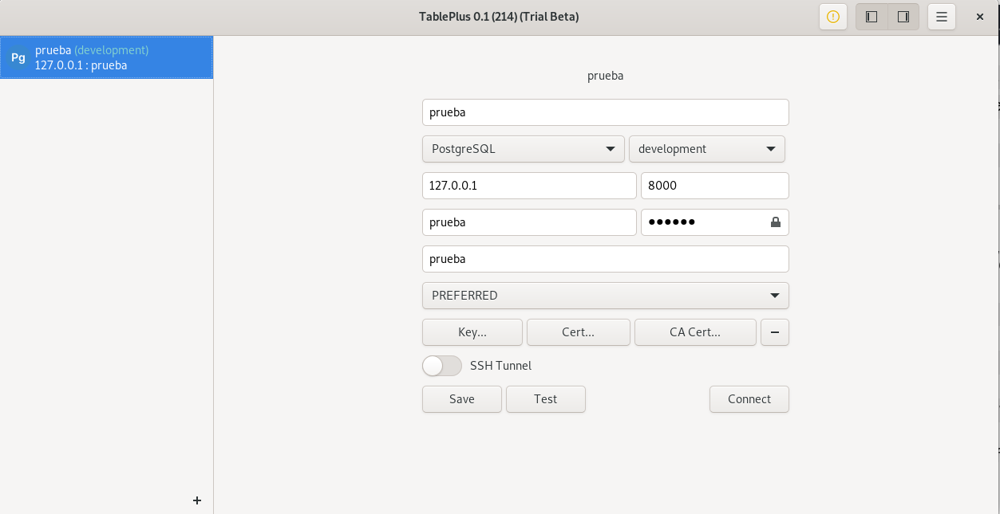

# Backend Django


### *Instructions to launch local django server*

```1.Pipenv install ```

```2.Go to folder where it is manage.py and enter pipenv shell ("pipenv shell")```

```3. python3 manage.py runserver```

---

### *Instructions to launch database server*

```1. Go where docker-compose.yml is located```

```2. Run "docker compose up"```

```3. Connect with yout database client on 127.0.0.1:8000```

